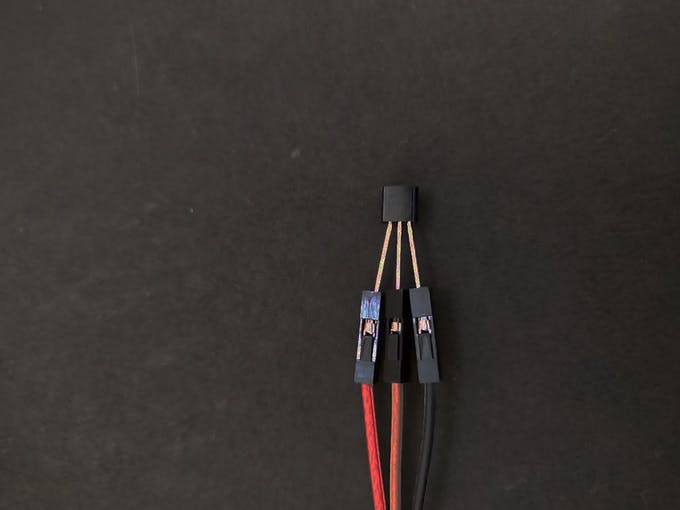
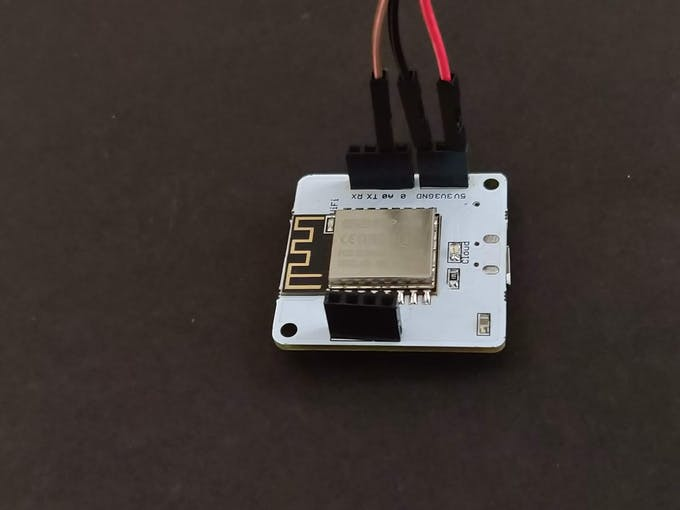
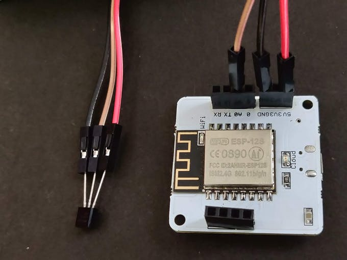
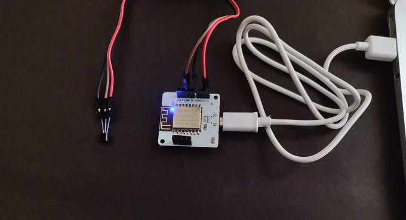
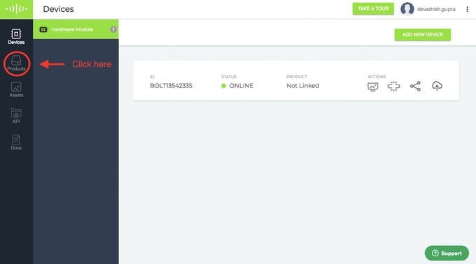
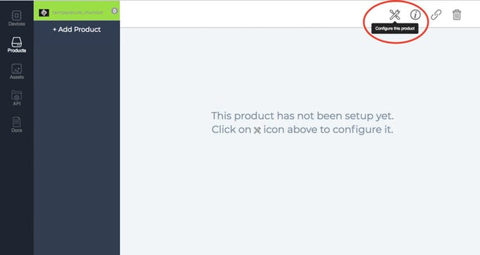
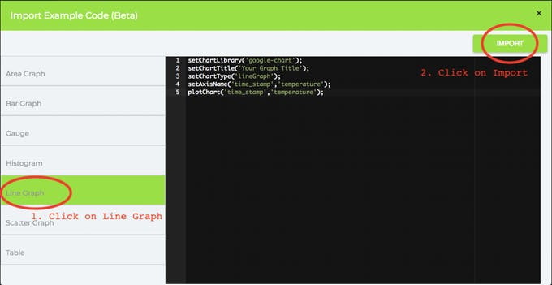

# Temprature_Monitoring_IOT_Project

 

<h3>Things used in this project</h3>
<li>Hardware components</li>
<li>Bolt IoT Bolt WiFi Module</li>
<li>LM35 sensor</li>
<li>Jumper wires</li>

<h3>Software apps and online services</h3>
<li>Bolt IoT Bolt Cloud</li>
<li>Bolt IoT Android App or Bolt IoT iOS App</li>

<h3>Story</h3>

Today, most of the products that we produce have a very crucial factor affecting them, temperature. Starting from the traditional crops to the artificial ones in food industries, from drugs to chemicals manufactured in the pharmaceutical industries, all of them need the right amount of temperature to be maintained for manufacture which is why the monitoring of temperature constantly is an indispensable part of these sectors.

Our homes too have a thermostat installed which monitor and regulate the temperature. Maintaining the right temperature is required for having a healthy growth of plants in a greenhouse. If the right temperature is not maintained, the plants will die.

<h3><strong>What will you build as part of this project?</strong></h3>
<li>Using this project, you will be able to build a temperature monitoring system to collect the data and send it to the cloud.</li>
<li>You will also learn to visualise the data in form of graphs.</li>
<li>This project can then be extended to Predict the future sensor values via machine learning over the Bolt Cloud.</li>

<h1>Gathering all required components</h1>
<li>Here is what you need for the project. All of these components are included in the Bolt Starter Kit.</li>

<h5>1. &nbsp; Bolt WiFi Module</h5>
&nbsp;&nbsp;&nbsp;

<h5>2. &nbsp; LM35 IC (Temperature sensor) </h5>
&nbsp;&nbsp;&nbsp;

Before we move to Step 1 make sure that your Blit WiFi Module is connected to Bolt Cloud and the green LED on Bolt Module is Glowing .If not then follow the steps in this project to set up the device.

<b>Part A: Building the circuit</b>
<b>Switch off before you get started</b>

Make sure you have not powered on your Bolt Module while connecting the circuit. This will ensure that in case we make any mistake, it will not short circuit your device. Switch off the power if it is connected.

Here is the pinout of the LM35 sensor. We need to connect the pins to the Bolt WiFi module accordingly.

&nbsp;&nbsp;&nbsp;

Connect the pins as given in the table below.

<table>
  <tr>
    <th>LM35 Pin</th>
    <th>Corresponding Bolt WiFi Module Pin</th>
    <th>Comment</th>
  </tr>
  <tr>
    <td>Vs Supply Voltage</td>
    <td>5V</td>
    <td>	LM35 sensor operates at 5V</td>
  </tr>
  <tr>
    <td>Vout - Output</td>
    <td>A0</td>
    <td>Since the output is analog and A0 is the only pin on Bolt WiFi module that can read an analog input.</td>
  </tr>
  <tr>
    <td>GND Ground</td>
    <td>GND Ground</td>
    <td>The ground pin of the LM35 to be connected to the ground pin of Bolt WiFi module</td>
  </tr>
</table>

Here is the same pin connections are shown in form of a circuit diagram.

&nbsp;&nbsp;&nbsp;

<strong><h3>Step 1: Take three male to female wires of three different colours. Different colours will help us avoiding confusion.</h3></strong>

You will also require the Bolt WiFi module and LM35 sensor.

&nbsp;&nbsp;&nbsp;

<strong><h3>Step 2: Plug the female end of the wires to the pins of the LM35 sensor.</h3></strong>
&nbsp;&nbsp;&nbsp;

<strong><h3>Step 3: Now we need to connect these ends of the LM35 sensor to the corresponding end of the Bolt WiFi module.</h3></strong>
<ul>
  <li>Connect the VCC pin of LM35 to 5V pin of the Bolt device.</li>
  <li>Connect the GND pin of LM35 to the GND pin of the Bolt device.</li>
  <li>Connect the analog output pin of LM35 to the A0 (analog input) pin of the Bolt device.<li>
  </ul>
&nbsp;&nbsp;&nbsp;
  
 <strong><h3>The colours will help you identify if you have connected the correct wire to the pins of the LM35 and Bolt WiFi module.
Here is how it will look. 👇 </h3></strong>

&nbsp;&nbsp;&nbsp;

<strong><h2>Check before you power on 👀
Make sure connections are made accurately. Ideally, review them again. Wrong connections can lead to a short circuit which can further lead to the device getting damaged permanently.</h2></strong>

 <strong><h3>Step 5: Power on the Bolt device</h3></strong>
 &nbsp;&nbsp;&nbsp;

Now your circuit is ready. 🎉

In the next step, we will be to work on the software and cloud configuration.

 
 <strong><h3>Part B: Connect your Bolt device to the Bolt Cloud</h3></strong>
 

Skip this step, if you already know how to connect your Bolt device to the Bolt Cloud. To check if it is connected to Cloud, have a look at the green coloured Cloud LED on the Bolt WiFi module. It should be glowing.

Follow the steps in this project to set up the device and to connect your Bolt device to the Bolt Cloud.<
  /p>
  
  <strong><h3>Part C: Collecting and visualising the data (Plotting Graph) on the Bolt Cloud</h3></strong>
  
  
Now we need to visualise the temperature data on the Bolt Cloud. For this create an account on cloud.boltiot.com if you have not already.

Just follow these simple steps:

  
  <strong>Login into cloud.boltiot.com and click on the 'Product' tab.</strong>
  
   &nbsp;&nbsp;&nbsp;
  
  
2. Create a new product for your temperature monitoring system. Products are created once and can be used for multiple Bolt devices. This ensures scalability for your IoT products you build on Bolt.

  <em> Note: Product names can only have alphabets, numbers, and underscore ( _ ) as a special character. Spaces are not allowed.</em>
  
   &nbsp;&nbsp;&nbsp;
  
   &nbsp;&nbsp;&nbsp;
  
  
3. Click on Configure this product to configure the product. This will open a popup where you can configure your products hardware setting and write the software code.

  
   &nbsp;&nbsp;&nbsp;
  
  
4. Click on the "A0" pin of the Bolt and give it a name in the right side naming section. Finally, click on the "Save" icon to save your change and wait for the page to reload.

  
   
  
  
5.Click on the Code Section then click on the "Import Code example" icon as shown below. This will open a pop-up menu where you can choose the variable. In this code since we have connected only one sensor, you could simply choose the only variable in the dropdown and press OK.

  
      
 

 

  
  
Now you will be presented with a variety of graphs to choose from. Choose the "Line Graph" and then click on the "Import" button.

  
         &nbsp;&nbsp;&nbsp;

  
Now let me explain each line of the code so that you could make suitable changes as you wish.

  
<em> setChartLibrary </em> function sets the Data Visualisation Library you would use. The most commonly used one on Bolt Cloud is the Google Library. However, you could use any other JavaScript or HTML code here to visualise the data.
 

  
<em>setChartTitle</em> function sets the Title of the Chart/Graph. Give a suitable name for your graph here which will be shown in the heading of the page. This is different from the name of the code file.</em>
 

<em>setChartType</em> function is where you choose which type of chart you want i.e. Line Graph, Bar Graph etc.
 

<em>setAxisName </em>will set the name for the X Axis and Y Axis
 

<em>plotChart</em> is where you choose which variable you want to choose in your chart.

  
