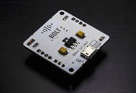
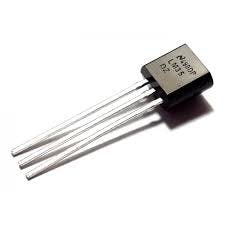
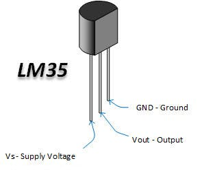
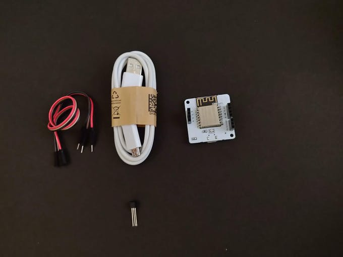

# Temprature_Monitoring_IOT_Project

<h3>Things used in this project</h3>
<li>Hardware components</li>
<li>Bolt IoT Bolt WiFi Module</li>
<li>LM35 sensor</li>
<li>Jumper wires</li>

<h3>Software apps and online services</h3>
<li>Bolt IoT Bolt Cloud</li>
<li>Bolt IoT Android App or Bolt IoT iOS App</li>

<h3>Story</h3>

Today, most of the products that we produce have a very crucial factor affecting them, temperature. Starting from the traditional crops to the artificial ones in food industries, from drugs to chemicals manufactured in the pharmaceutical industries, all of them need the right amount of temperature to be maintained for manufacture which is why the monitoring of temperature constantly is an indispensable part of these sectors.

Our homes too have a thermostat installed which monitor and regulate the temperature. Maintaining the right temperature is required for having a healthy growth of plants in a greenhouse. If the right temperature is not maintained, the plants will die.

<h3><strong>What will you build as part of this project?</strong></h3>
<li>Using this project, you will be able to build a temperature monitoring system to collect the data and send it to the cloud.</li>
<li>You will also learn to visualise the data in form of graphs.</li>
<li>This project can then be extended to Predict the future sensor values via machine learning over the Bolt Cloud.</li>

<h1>Gathering all required components</h1>
<li>Here is what you need for the project. All of these components are included in the Bolt Starter Kit.</li>

<h5>1. &nbsp; Bolt WiFi Module</h5>
&nbsp;&nbsp;&nbsp;

<h5>2. &nbsp; LM35 IC (Temperature sensor) </h5>
&nbsp;&nbsp;&nbsp;

Before we move to Step 1 make sure that your Blit WiFi Module is connected to Bolt Cloud and the green LED on Bolt Module is Glowing .If not then follow the steps in this project to set up the device.

<b>Part A: Building the circuit</b>
<b>Switch off before you get started</b>

Make sure you have not powered on your Bolt Module while connecting the circuit. This will ensure that in case we make any mistake, it will not short circuit your device. Switch off the power if it is connected.

Here is the pinout of the LM35 sensor. We need to connect the pins to the Bolt WiFi module accordingly.

&nbsp;&nbsp;&nbsp;

Connect the pins as given in the table below.

<table>
  <tr>
    <th>LM35 Pin</th>
    <th>Corresponding Bolt WiFi Module Pin</th>
    <th>Comment</th>
  </tr>
  <tr>
    <td>Vs Supply Voltage</td>
    <td>5V</td>
    <td>	LM35 sensor operates at 5V</td>
  </tr>
  <tr>
    <td>Vout - Output</td>
    <td>A0</td>
    <td>Since the output is analog and A0 is the only pin on Bolt WiFi module that can read an analog input.</td>
  </tr>
  <tr>
    <td>GND Ground</td>
    <td>GND Ground</td>
    <td>The ground pin of the LM35 to be connected to the ground pin of Bolt WiFi module</td>
  </tr>
</table>

Here is the same pin connections are shown in form of a circuit diagram.

&nbsp;&nbsp;&nbsp;

<strong><h3>Step 1: Take three male to female wires of three different colours. Different colours will help us avoiding confusion.</h3></strong>

You will also require the Bolt WiFi module and LM35 sensor.

&nbsp;&nbsp;&nbsp;

<strong><h3>Step 2: Plug the female end of the wires to the pins of the LM35 sensor.</h3></strong>
